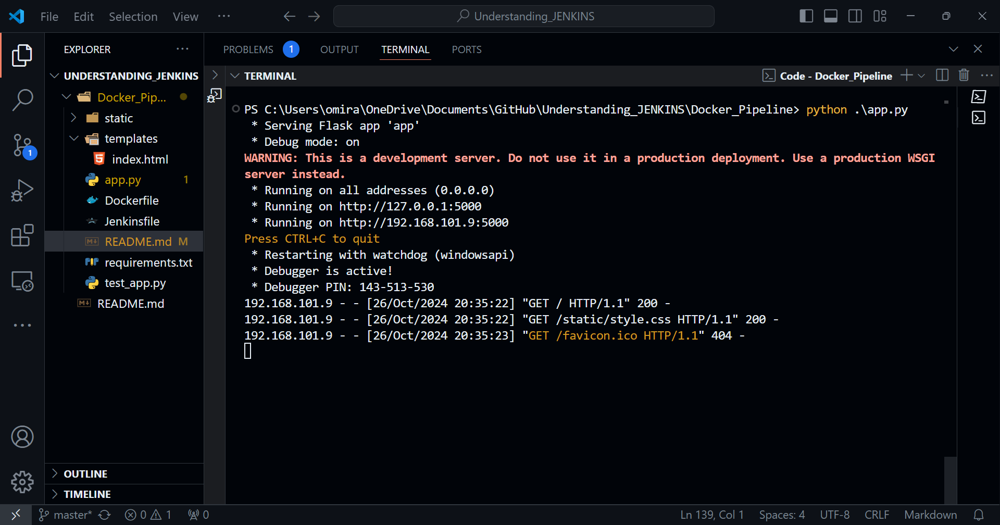
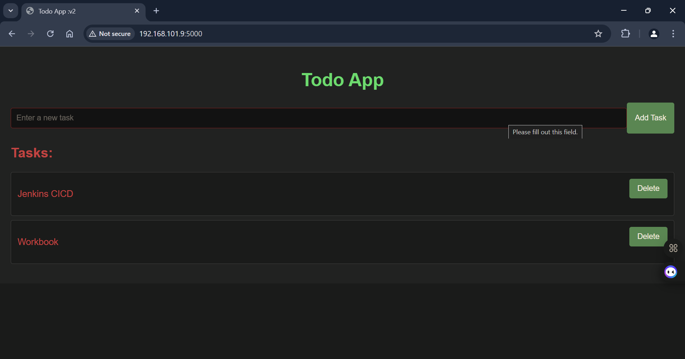
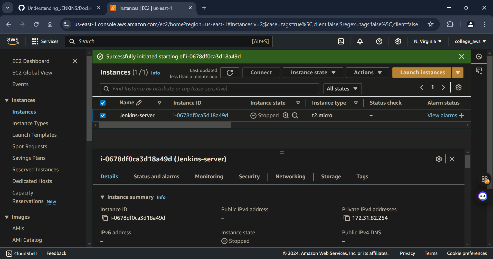

This guide covers the installation of necessary software, configuration steps, and any prerequisites needed for setting up Jenkins with Docker and Python.


## Prerequisites

Before you begin, ensure you have the following installed on your system:

1. **Operating System**: A supported version of Ubuntu, Debian, CentOS, or a similar Linux distribution.
2. **User Permissions**: Ensure you have sudo privileges to install packages and modify system settings.

## Step 1: Install Java

Jenkins requires Java to run. You can install the OpenJDK package with the following commands:

```bash
sudo apt update
sudo apt install openjdk-17-jre
```

### Verify Installation

Check the Java version:

```bash
java -version
```

## Step 2: Install Jenkins

1. **Add Jenkins Repository Key**:

```bash
curl -fsSL https://pkg.jenkins.io/debian-stable/jenkins.io-2023.key | sudo tee /usr/share/keyrings/jenkins-keyring.asc > /dev/null
```

2. **Add Jenkins Repository**:

```bash
 echo deb [signed-by=/usr/share/keyrings/jenkins-keyring.asc]   https://pkg.jenkins.io/debian-stable binary/ | sudo tee   /etc/apt/sources.list.d/jenkins.list > /dev/null
```

3. **Install Jenkins**:

```bash
sudo apt update
sudo apt install jenkins
```

### Start Jenkins

Start the Jenkins service and enable it to run on boot:

```bash
sudo systemctl start jenkins.service
sudo systemctl enable jenkins.service
```

### Verify Installation

Check the status of Jenkins:

```bash
sudo systemctl status jenkins
```

## Step 3: Install Docker

Jenkins can use Docker to manage containers. Install Docker using the following commands:

```bash
sudo apt update
sudo apt install -y docker.io
```

### Start Docker

Enable and start the Docker service:

```bash
sudo systemctl start docker
sudo systemctl enable docker
```

### Add Jenkins User to Docker Group

To allow the Jenkins user to run Docker commands without `sudo`:

```bash
sudo usermod -aG docker jenkins
```

**Note**: After adding the user to the Docker group, you may need to restart the Jenkins service:

```bash
sudo systemctl restart jenkins
```

## Step 4: Install Python and Virtual Environment

Install Python 3 and pip:

```bash
sudo apt install python3 python3-pip
```

Install the `venv` module for creating virtual environments:

```bash
sudo apt install python3-venv
```

### Create and Activate a Virtual Environment

Navigate to your project directory and create a virtual environment:

```bash
cd /path/to/your/project
python3 -m venv .venv
source .venv/bin/activate
```

### Install Project Dependencies

If your project includes a `requirements.txt` file, install the dependencies:

```bash
pip install -r requirements.txt
```

## Step 5: Accessing Jenkins

1. Open your web browser and navigate to `http://localhost:8080` (or replace `localhost` with your server's IP address).
2. Retrieve the initial admin password:

```bash
sudo cat /var/lib/jenkins/secrets/initialAdminPassword
```
***Locally Testing the application***


***Application Interface***


***THE JENKINS PART:***
Login to jenkins server in my case I am running it as EC2 instance here's the Screen:


Grab the public IP of your instance and run it on port number 8080(by default port number).
Also make sure that security groups are configured to have inbound traffic rule for port number 8080.


The user name is admin and password can be retrieved from the steps given above.
***Jenkins Pipeline stages***


***Docker hub repository with successfull build and push image***


***Docker images using CLI:***
